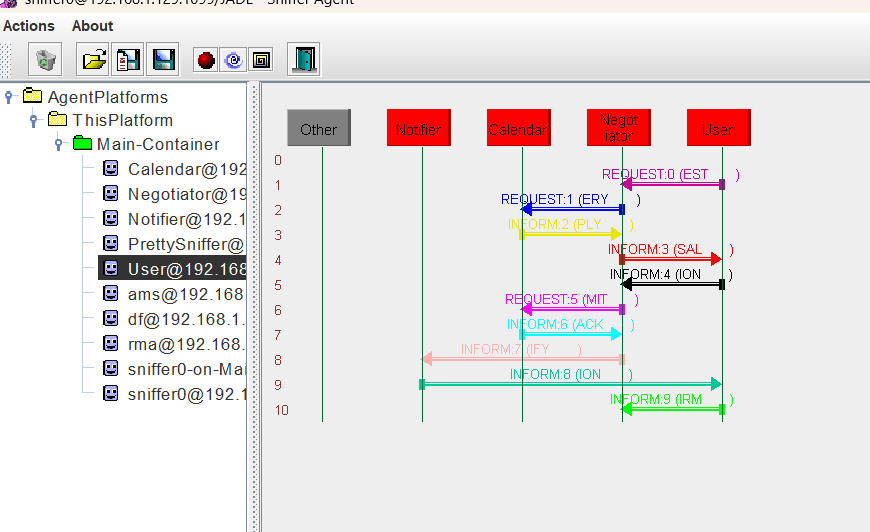
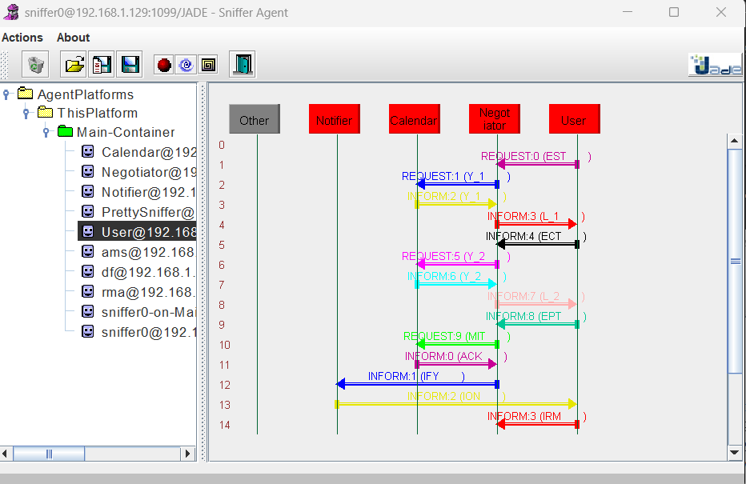
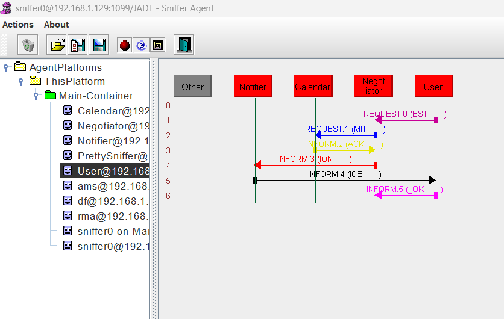

# JADE Multi-Agent Meeting Scheduler
A complete multi-agent system implemented using **JADE** to simulate a meeting scheduling workflow with automated negotiation, notification, and calendar management.
This project implements **three distinct use cases**, each demonstrating different interaction paths between User, Negotiator, Calendar, and Notifier agents.

---

## 📌 Project Overview
This system simulates how autonomous agents collaborate to schedule or update meetings.
Agents negotiate time slots, check calendar availability, and notify the user of final results.

### System Agents

| Agent | Responsibility |
|-------|----------------|
| **UserAgent** | Initiates the scenario (UC1, UC2, UC3) |
| **NegotiatorAgent** | Coordinates all scheduling logic |
| **CalendarAgent** | Validates and stores availability/time slots |
| **NotifierAgent** | Sends final confirmation or rejection messages |
| **Sniffer/PrettySniffer** | Visual tracing of ACL message interactions |

All agents except **UserAgent** start automatically inside JADE's RMA.
The user launches different scenarios by starting UserAgent with arguments.

In JADE RMA:

Name: User
Class: app.agents.UserAgent

Arguments:

UC1 — for meeting request

UC2 — for rescheduling

UC3 — for cancellation

Then press Start.


---

## 📌 Implemented Use Cases

### ✔ Use Case 1 — Initial Meeting Request
**Goal:** User requests a meeting → system checks availability → confirms the meeting.

Flow:
1. UserAgent sends MeetingRequest
2. NegotiatorAgent sends FreeBusyQuery to CalendarAgent  
3. CalendarAgent returns FreeBusyReply  
4. NegotiatorAgent sends final Proposal to UserAgent  
5. UserAgent accepts
6. Negotiator sends Commit to CalendarAgent
7. CalendarAgent returns CommitAck
8. NotifierAgent sends final confirmation

📸 **Sniffer Output (UC1)**


---

### ✔ Use Case 2 — Conflict Detected & Alternative Returned (Rescheduling )
**Goal:** The initially proposed time is not accepted by the user → the system provides an alternative meeting slot.

Flow:

1.	UserAgent sends an initial MeetingRequest
2.	NegotiatorAgent requests availability by sending a FreeBusyQuery to the CalendarAgent
3.	CalendarAgent returns a first available slot
4.	NegotiatorAgent sends the first Proposal to the user
5.	UserAgent rejects the first proposal (e.g., conflict from user side)
6.	NegotiatorAgent requests a second slot by sending another FreeBusyQuery
7.	CalendarAgent returns an alternative available time
8.	NegotiatorAgent sends the second Proposal to the user
9.	UserAgent accepts the new proposal
10.	NegotiatorAgent sends Commit to CalendarAgent
11.	CalendarAgent confirms the booking with CommitAck
12.	NotifierAgent sends the final updated confirmation to the UserAgent


📸 **Sniffer Output (UC2)**


---

### ✔ Use Case 3 — Cancelling a Meeting
**Goal:** User decides to cancel an already scheduled meeting → system frees the reserved slot and sends cancellation notices.

Flow:
1. UserAgent sends CancelRequest  
2. NegotiatorAgent forwards CancelCommit to CalendarAgent  
3. CalendarAgent releases the time slot and returns CancelAck
4. NegotiatorAgent forwards NotifyCancellation to NotifierAgent
5. NotifierAgent sends SendCancelNotice to UserAgent
6. UserAgent confirms CancellationOK  

📸 **Sniffer Output (UC3)**


---

## 📂 Project Structure

```
src/
└── main/java/app/
    ├── agents/
    │   ├── UserAgent.java
    │   ├── NegotiatorAgent.java
    │   ├── CalendarAgent.java
    │   ├── NotifierAgent.java
    │   └── PrettySnifferAgent.java
    ├── messages/
    │   ├── Models.java
    │   └──JsonUtil.java
    ├── util/
    │   └── LogWriter.java
    └── boot/
        └── GuiAutoBoot.java

logs/
├── UC1.log
├── UC2.log
└── UC3.log
```

Each use case automatically generates its own log file (e.g., `UC1.log`).

---

## 🔧 How to Compile

```sh
javac -cp "libs/*;src/main/java" -d build/classes/java/main   src/main/java/app/messages/*.java   src/main/java/app/util/*.java   src/main/java/app/agents/*.java   src/main/java/app/boot/*.java
```
```
Or
gradle build
```
---

## ▶ How to Run (Start JADE Platform)

Start all agents **except UserAgent**:

### Use Case 1
```sh
java "-Ddemo.uc=UC1" -cp ".;libs/*;build/classes/java/main" app.boot.AutoBoot
```

### Use Case 2
```sh
java "-Ddemo.uc=UC2" -cp ".;libs/*;build/classes/java/main" app.boot.AutoBoot
```

### Use Case 3
```sh
java "-Ddemo.uc=UC3" -cp ".;libs/*;build/classes/java/main" app.boot.AutoBoot
```


This launches:

- CalendarAgent
- NegotiatorAgent
- NotifierAgent
- PrettySnifferAgent
- RMA Tools


---

## 📝 Logging

Each run writes ACL messages into:

```
logs/UC1.log
logs/UC2.log
logs/UC3.log
```

These logs match the Sniffer message flow.

---

## 📌 Requirements

- Java 8+
- JADE 4.5.0
- gson 2.10.1
- org.json 20210307

---

## 📜 License
MIT License – free to use and modify.

---

## 📧 Contact
For questions or extensions, feel free to reach out.
